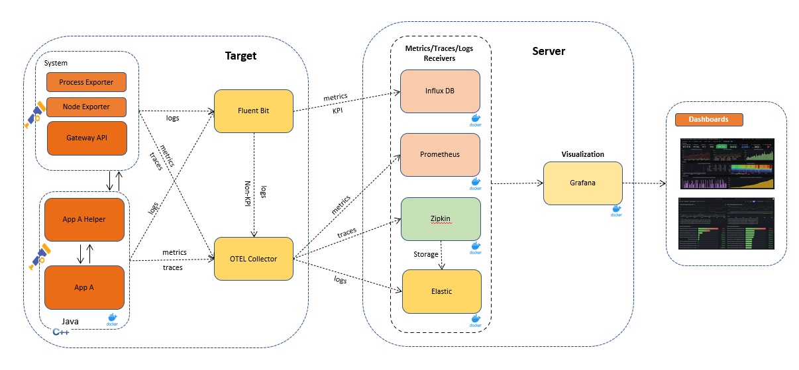
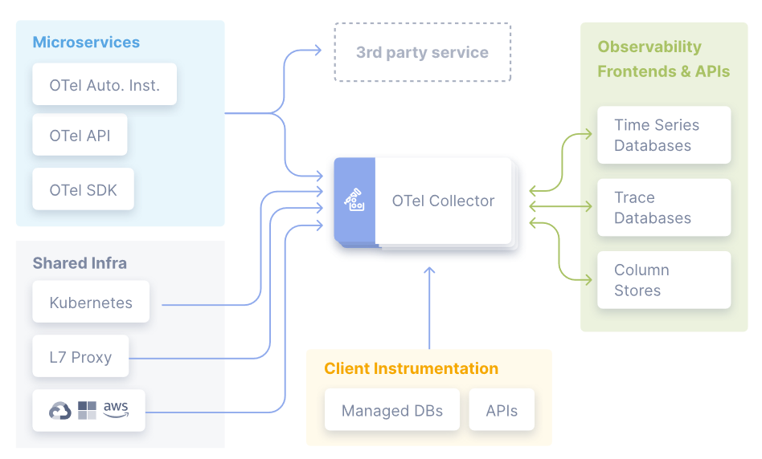
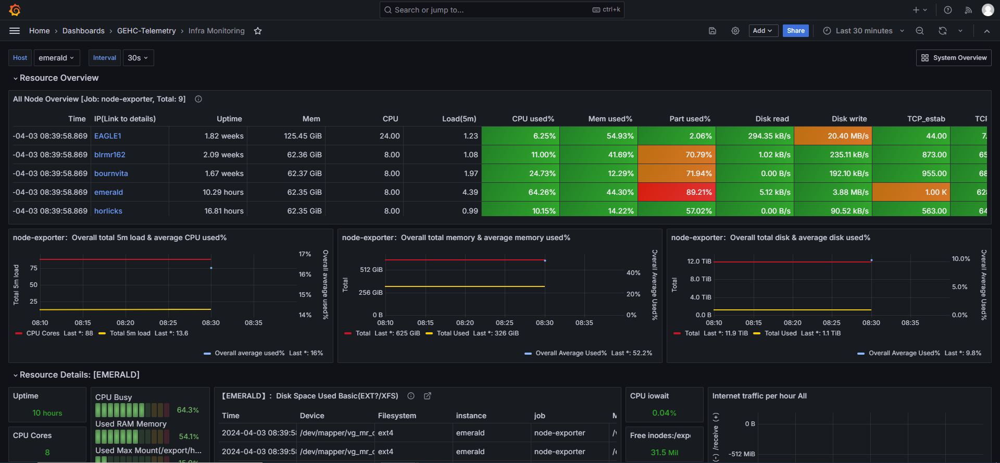
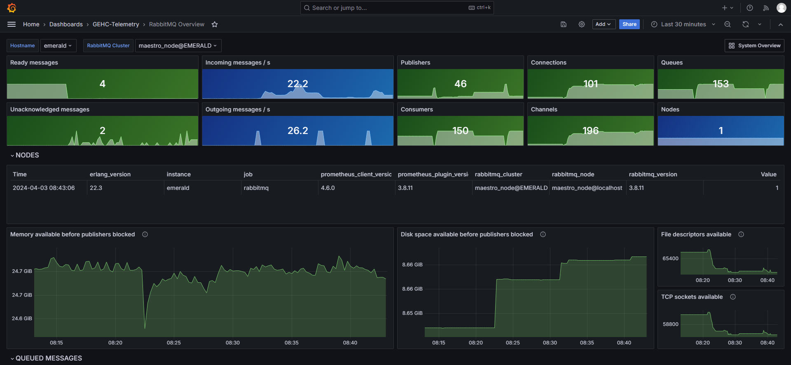

# Telemetry monitoring

This project aims to provide capabilities to provide system monitoring using Prometheus, Elasticsearch, Kibana, Zipkin and Grafana by providing Telemetry agents which can push the metrics to Prometheus, traces to Zipkin and logs to Elasticsearch for further monitoring and observation.

## Architecture

The architecture of  Telemetry monitoring system include multiple databases like Prometheus,InfluxDB and Elasticsearch as well running in the centralized server (__). The data is sent to the  server using the OTEL Collector agent and Fluent-bit for logs.


 

# OTEL Collector
OTEL Collector is installed on the Target system and used as an agent to collect the data and sent to the  server.

 

For further information on how the OTEL is configured, check [README](otelcol-contrib/README.md)

## _node_exporter_ ( Node Exporter)

Node Exporter provides multiple metrics fr a single container. In our case the complete linux host device as a single container and 
This provides a top level view of the complete system resources (CPU, Memory, RSS, File handles and so on)
Here is a example view



## RabbitMQ

For monitoring RabbitMQ monitoring, we use rabbitmq-prometheus plugin, which provides important metrics for the rabbitmq server instance running on the system



# Fluent-Bit
Fluent-Bit was installed and configured on the tarrget machine to collect logs from the logfiles. It is used to read the KPI logfiles and send the data as metrics to InfluxDB and non-KPI logfiles as logs to OTEL Collector.

For further information on how the Fluent-Bit is configured, check [README](fluent-bit/README.md)


# Instructions to create and install rpm
MR system monitoring solution is currently available for all MR systems as part of _mrtest_ package.
_mrtest_ package is installed into all the in house systems as part of LFC except customer bays, 
hence this solution would be available in the system where _mrtest_ package is installed.

If there is a need to change the source and install our own version of rpm please follow the steps below:
- clone the repo and run the build command `./gradlew clean buildRpm` ( Add `-Pjdk` as an argument if you want to include java jdk as part of rpm)
- Copy system-resource-usage-monitor.xxx.rpm to the system where we want to test using
```shell
scp system-resource-usage-monitor-1.0.0.i386.rpm sdc@destinstion_ip:/export/home/sdc 
```
- Login to target and install rpm as a root 
```shell
sudo rpm -ivf --force system-resource-usage-monitor-1.0.0.i386.rpm
cd /export/home/testdata/monitor/system-resource-usage-monitor
```


# Instructions to run petclinic with otel java agent

```shell
java -javaagent:path/to/opentelemetry-javaagent.jar \
     -Dotel.resource.attributes=service.name=petclinic-app \
     -Dotel.traces.exporter=zipkin \
     -jar path/to/app.jar
```


